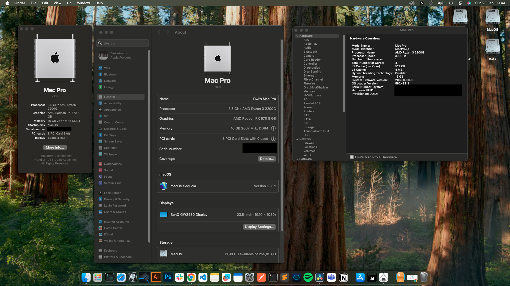

## Opencore EFI for AMD Ryzen Hackintosh - MacOS Sequioa

## Disclaimer
Use at your own risk. I take no responsiblity if your rig explodes. Create unique SMBios values for your rig. Don't copy ones shown in the config.plist!!!

## Important information
* This EFI I create sprecialy for MacOS Sequioa, never tested with older MacOS Version

## Specification

| Component        | Model                                              |
| ---------------- | ---------------------------------------------------|
| CPU              | AMD Ryzen 3 3300G                                  |
| MotherBoard      | Asrock X370                                        |
| Ethernet         | RealtekRTL8111                                     |
| OS Disk          | ADATA Nvme 256gb                                   |
| RAM              | 4x 4gb 2666Mhz Ram                                 |
| GPU              | AMD Radeon RX570 8gb                               |

## Working

* iCloud
* Ethernet
* iServices & drm
* Audio (Front And Rear)

## Not Working ( only ones I have tried, there may be more )

* Sleep ( Working )
* Sidecar

## Patches, Drivers & Kexts

* [AppleALC](https://github.com/acidanthera/AppleALC)
* [AppleMCEReporterDisabler](https://github.com/acidanthera/bugtracker/files/3703498/AppleMCEReporterDisabler.kext.zip)
* [BrcmPatchRAM](https://github.com/acidanthera/BrcmPatchRAM)
* [Kernel Patches](https://github.com/AMD-OSX/AMD_Vanilla) ( Newer universal patches introduced in [this](https://github.com/sileshn/Ryzentosh/commit/adcb87fa003a0e77afaded014984a00ecb07b775) commit requires you to update the core count of your processor. For more information on this subject, click [here](https://github.com/AMD-OSX/AMD_Vanilla#read-me-first).)
* [Lilu](https://github.com/acidanthera/Lilu)
* [OpenCore](https://github.com/acidanthera/OpenCorePkg)
* [OpenIntelWireless](https://github.com/OpenIntelWireless)
* [RealtekRTL8111](https://github.com/Mieze/RTL8111_driver_for_OS_X)
* [RestrictEvents](https://github.com/acidanthera/RestrictEvents)
* [VirtualSMC](https://github.com/acidanthera/VirtualSMC)
* [WhateverGreen](https://github.com/acidanthera/WhateverGreen)

## Bootloader

I use OpenCore to multiboot Windows(11) and MacOS(Sequoia)

## Credits and links

* [OpenCore install guide](https://dortania.github.io/OpenCore-Install-Guide)
* [Hackintool](https://www.hackintosh-forum.de/forum/thread/38316-hackintool-ehemals-intel-fb-patcher)
* [OpenCore-Legacy-Patcher](https://github.com/dortania/OpenCore-Legacy-Patcher)
* [OpenCore-Legacy-Patcher guide](https://dortania.github.io/OpenCore-Legacy-Patcher)
